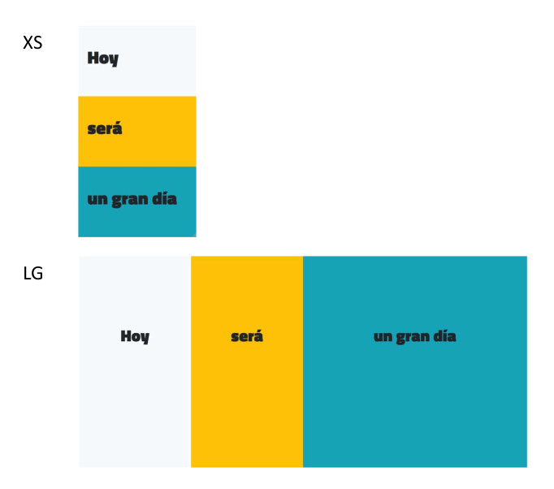

<h1>Maquetacion III</h1>

Crea la siguiente maquetacion combinando Bootstrap y una CSS propia, teniendo en cuenta que:

<ul>
    <li>La tipografia utilizada es Titilium Web.</li>
    <li>Las 3 franjas ocupan en cualquier resolucion exactamente el 100% de alto y ancho de la pantalla, ni mas ni menos.</li>
</ul>
